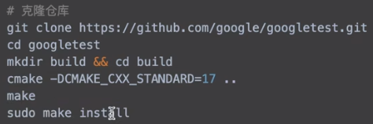
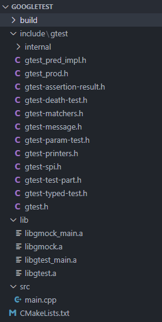
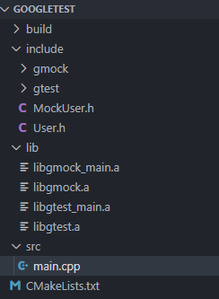

# 单元测试 Goole Test

## 1. 简介

- gtest			# 已有功能的单元测试

- gmock         # 只有接口，未完全实现功能的单元测试

- 仓库下载

  

## 2. gtest使用

目录结构：



测试代码：

- main.cpp

```cpp
#include <iostream>
#include <gtest/gtest.h>

using namespace std;

int add(int a, int b) {
    return a + b;
}

TEST(test_case_1, should_3_when_given_1_and_2) {
    EXPECT_EQ(add(1, 2), 3);
}

int main(int argc, char** argv) {
    testing::InitGoogleTest(&argc, argv);
    return RUN_ALL_TESTS();
}	
```

运行结果：

```bash
PS E:\GitHub\GoogleTest\build> ."E:/GitHub/GoogleTest/build/gtest.exe"
[==========] Running 1 test from 1 test suite.
[----------] Global test environment set-up.
[----------] 1 test from test_case_1
[ RUN      ] test_case_1.should_3_when_given_1_and_2
[       OK ] test_case_1.should_3_when_given_1_and_2 (0 ms)
[----------] 1 test from test_case_1 (2 ms total)

[----------] Global test environment tear-down
[==========] 1 test from 1 test suite ran. (48 ms total)
[  PASSED  ] 1 test.
```

## 3. gmock使用

目录结构：



测试代码：

- User.h

```cpp
#ifndef USER_H
#define USER_H

class User {
public:
    virtual int getAge() = 0;
};
#endif //USER_H

```

- MockUser.h

```cpp
#ifndef MOCKUSER_H
#define MOCKUSER_H

#include "User.h"
#include <gmock/gmock.h>

class MockUser: public User {
public:
    MOCK_METHOD(int, getAge, (), (override));
};

#endif //MOCKUSER_H
```

- main.cpp

```cpp
#include <iostream>
#include <gtest/gtest.h>
#include <gmock/gmock.h>
#include "MockUser.h"

using namespace std;

int add(int a, int b) {
    return a + b;
}

TEST(test_case_1, should_3_when_given_1_and_2) {
    EXPECT_EQ(add(1, 2), 3);
}

TEST(test_case_2, should_3_when_given_1_and_2) {
    MockUser user;
    EXPECT_CALL(user, getAge).
    Times(::testing::AtLeast(3)).
    WillOnce(::testing::Return(200)).
    WillOnce(::testing::Return(300)).
    WillRepeatedly(::testing::Return(500));

    cout << user.getAge() << endl;
    cout << user.getAge() << endl;
    cout << user.getAge() << endl;
    cout << user.getAge() << endl;
}

int main(int argc, char** argv) {
    testing::InitGoogleTest(&argc, argv);
    return RUN_ALL_TESTS();
}

```

运行结果：

```bash
PS E:\GitHub\GoogleTest\build> ."E:/GitHub/GoogleTest/build/gtest.exe"
[==========] Running 2 tests from 2 test suites.
[----------] Global test environment set-up.
[----------] 1 test from test_case_1
[ RUN      ] test_case_1.should_3_when_given_1_and_2
[       OK ] test_case_1.should_3_when_given_1_and_2 (0 ms)
[----------] 1 test from test_case_1 (7 ms total)

[----------] 1 test from test_case_2
[ RUN      ] test_case_2.should_3_when_given_1_and_2
200
300
500
500
[       OK ] test_case_2.should_3_when_given_1_and_2 (25 ms)
[----------] 1 test from test_case_2 (30 ms total)

[----------] Global test environment tear-down
[==========] 2 tests from 2 test suites ran. (58 ms total)
[  PASSED  ] 2 tests.
```
